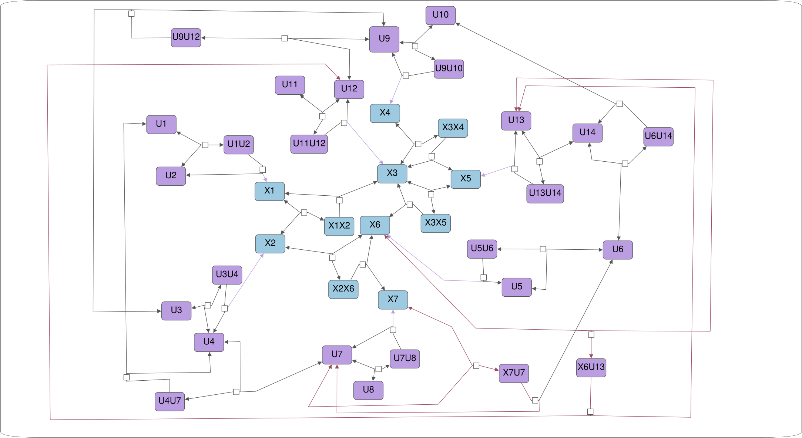
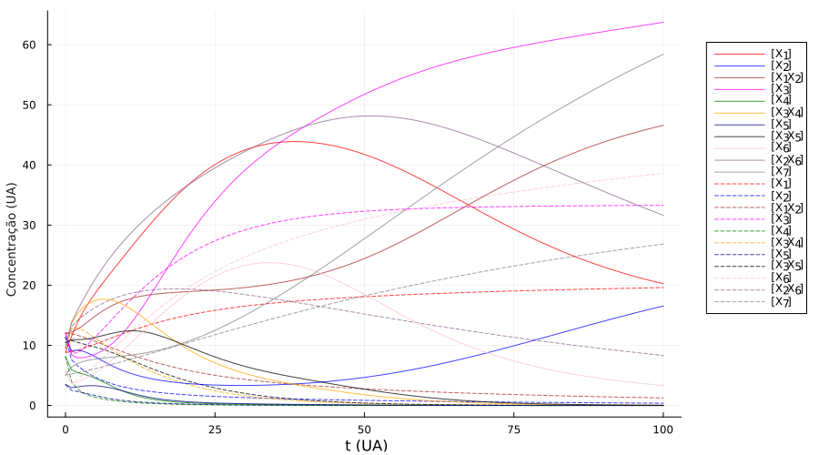
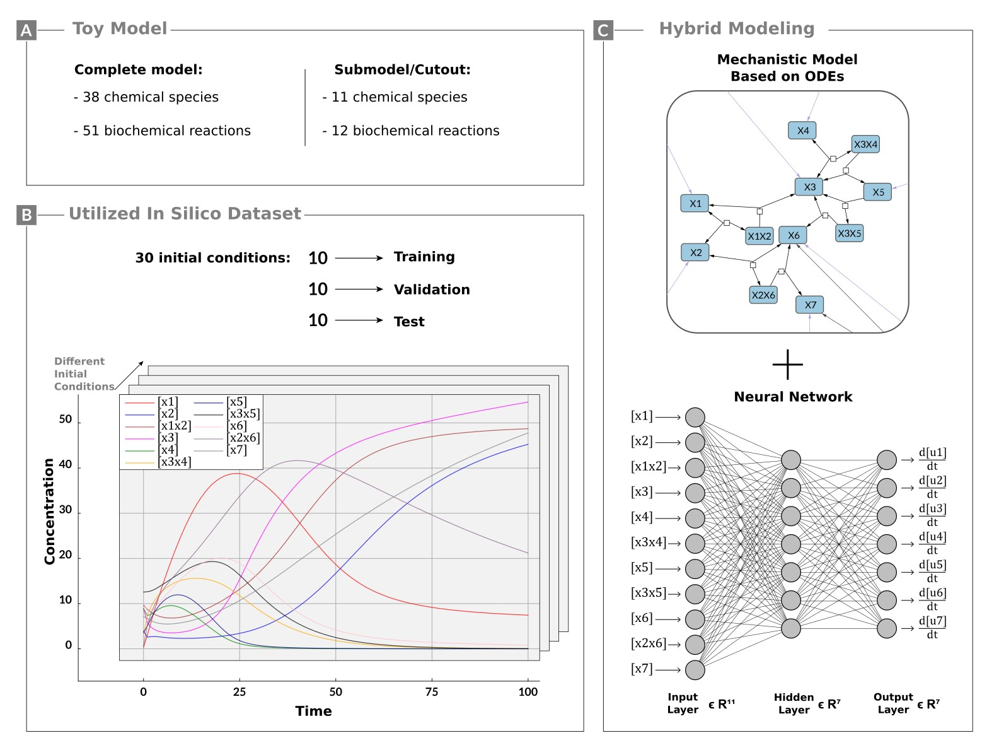

#  BSB-2023-Hybrid-modeling

Source code of the experiments carried out for Nogueira et al. (2023), submitted to the BSB 2023.

## Table of Contents

- [Introduction](#introduction)
- [Code Prerequisites](#code-prerequisites)
- [Running the Experiment](#running-the-experiment)
- [Results](#results)
- [Folder Structure](#folder-structure)
- [License](#license)
- [Acknowledgments](#acknowledgments)

## Introduction

This repository contains the source code for the experiment detailed in the paper presented at the Brazilian Symposium on Bioinformatics conference, titled [Exploring Identifiability in Hybrid Models of Cell Signaling Pathways](https://link.springer.com/chapter/10.1007/978-3-031-42715-2_14). 

In summary, let's assume that the following model is a complete one in the sense that it has no information missing:



We can then create a submodel from the complete one, as illustrated by the blue nodes. However, it's important to note that this second model is not complete and suffer from the lack of isolation problem, as it behaves differently compared to the complete one, depicted bellow:

 *Solid lines represent the dynamics of the complete model, whereas the dashed lines depict the dynamics of the submodel.*

Therefore, the paper explores the use of hybrid modeling to address the isolation problem that arises when modeling the cell signaling pathway. The image below summarizes the approach taken:

*[A] depicts the complete and submodels. [B] Describes the dataset utilized for model training. [C] Provides an overview of the model architecture.*


## Code Prerequisites

To run this code you will neet to install the [The Julia Programming Language](https://julialang.org/) and the following julia packages:

```
BSON.jl
ComponentArrays.jl
Dates.jl
DelimitedFiles.jl
DifferentialEquations.jl
Flux.jl
JLSO.jl
JSON.jl
LineSearches.jl
NNlib.jl
Random.jl
SciMLBase.jl
SciMLSensitivity.jl
Statistics.jl  
TimerOutputs.jl
```

## Running the Experiment

To run the experiment, execute the following command in the terminal:

```bash
julia ./hybrid_model_train.jl --folder-model ./ --config hybrid_model_config.json
```

The file `hybrid_model_train.jl` is the main file that runs the experiment, when executing this code, use the --folder-model parameter to specify the directory containing the model files, and the --config parameter to indicate the path to the experiment configuration file. The configuration file includes settings such as the maximum number of ADAM iterations, among other parameters:

```json
{
    "modelFile": "hybrid_model_config.jl", // the julia code of the hybrid model
    "conditionFolder": "conditions_101pts", // the folder that contains the data set
    "valSize": 10, // number of initial conditions for validation
    "testSize": 10,// number of initial conditions for test
    "trainSize": 10, // number of initial conditions for training
    "adamIterations": 2000, // ADAM optimizer max iterations
    "bfgsIterations": 1000,  // BFGS optimizer max iterations
    "savePointsAt": 1, // distance in time of each point
    "plotScatter": false // scatter plot of the simulations
}
```

## Results

After executing the code, a new folder will be generated at `conditions_101pts/results_{config file name}`. This folder will store the experiment results, including the trained neural network parameters and individual plots for each dataset.

## Folder Structure

Below, the folder structure is illustrated, displaying the main folders and files:

```
project-root/
│
├── hybrid_model_train.jl
├── hybrid_model_config.jl
├── hybrid_model_config.json
├── timeseries_generator.ipynb
├── conditions_101pts/ 
│   ├── test_condition_1.bson
│   ├── test_condition_2.bson
│   └── ...
├── img/
├── util/
└── reported_results_sigmoid_1_layer_7x7/
```

The `conditions_101pts` directory contains the dataset utilized by the code for running the experiment, with each initial condition timeseries stored in BSON format. The `reported_results_sigmoid_1_layer_7x7` folder stores the results reported in the paper. The Jupyter notebook `timeseries_generator.ipynb` was employed to generate synthetic data for the experiments.

## License

For more details, take a look at [LICENSE](LICENSE).

## Acknowledgments

The authors thank Juliane Liepe (Max Planck Institute for Multidisciplinary Sciences, Germany) for her intellectual input in an earlier project in the same research line. This work was supported by CAPES, BECAS Santander and by grants 13/07467-1, 15/22308-2, 19/21619-5, 19/24580-2, and 21/04355-4, São Paulo Research Foundation (FAPESP). The authors also acknowledge the National Laboratory for Scientific Computing (LNCC, Brazil) for providing HPC resources of the SDumont supercomputer \href{http://sdumont.lncc.br}{(sdumont.lncc.br)}.